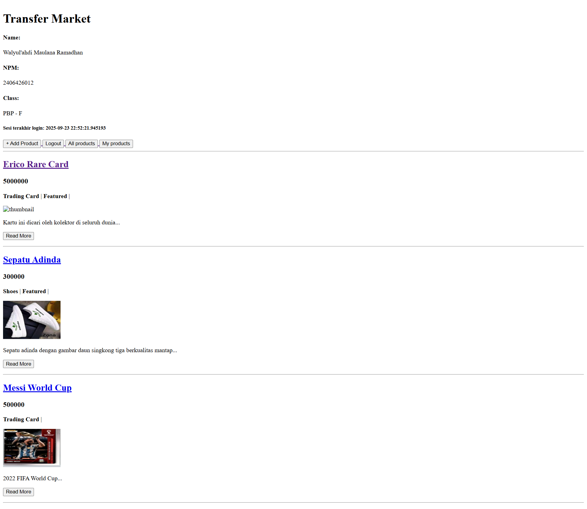
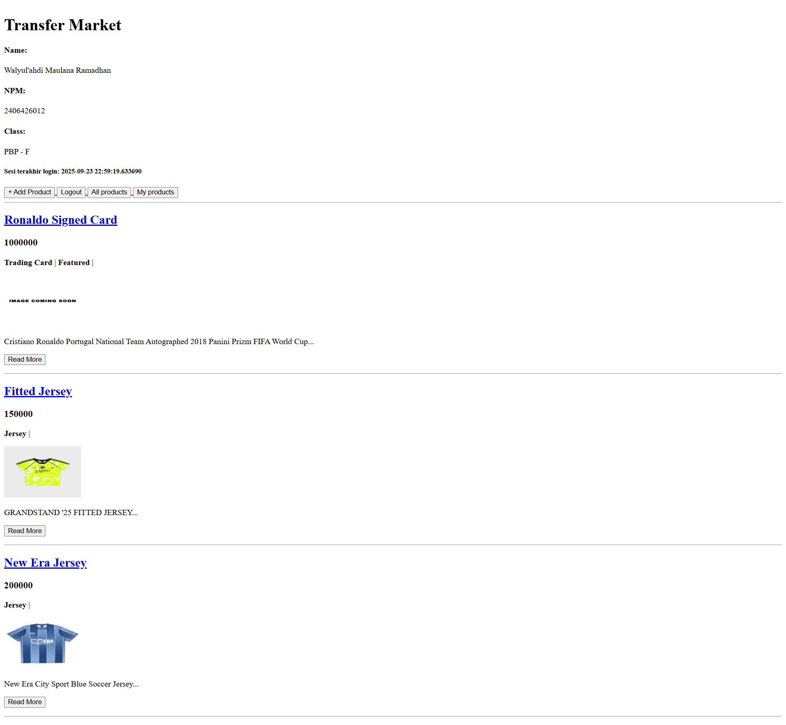

# Transfer Market

Tautan pws: https://walyulahdi-maulana-transfermarket.pbp.cs.ui.ac.id/

## Tugas 2

### Step-by-step Implementasi Checklist (Tugas 2)

1. Saya membuat proyek Django baru dengan menjalankan command

   ```bash
   django-admin startproject transfer_market
   ```

2. Membuat aplikasi main dengan command

   ```bash
   python manage.py startapp main
   ```

   kemudian menambahkan `'main'` ke dalam `INSTALLED_APP` pada `settings.py`.

3. Melakukan routing main dengan menambahkan

   ```python
   path('', include('main.urls'))
   ```

   pada `transfer_market/urls.py`.

4. Membuat model Product pada `main/models.py`

   ```python
   class Product(models.Model):
       name = models.CharField()
       price = models.IntegerField()
       description = models.TextField()
       thumbnail = models.URLField()
       category = models.CharField()
       is_featured = models.BooleanField()
       rating = models.FloatField()
   ```

5. Membuat fungsi pada `main/views.py`
   ```python
   def show_main(request):
       context = {
           'name' : 'Walyul\'ahdi Maulana Ramadhan',
           'npm' : '2406426012',
           'class' : 'PBP - F'
       }
       return render(request, "main.html", context)
   ```
6. Melakukan routing juga pada `main/urls.py`, dengan menambahkan
   ```python
   urlpatterns = [
       path('', show_main, name='show_main'),
   ]
   ```

### Bagan


### Peran settings.py dalam proyek Django

Mengatur konfigurasi proyek, seperti:

- INSTALLED_APP  
  Daftar aplikasi yang digunakan
- DATABASES  
  Koneksi ke database
- TEMPLATES  
  Konfigurasi template
- ALLOWED_HOSTS  
  Daftar host yang mempunyai akses

### Cara kerja migrasi database di Django

1. Saat menambah dan mengubah model menjalankan command

   ```bash
   python manage.py makemigrations
   ```

   File migrasi dibuat berdasarkan perubahan pada `models.py`.

2. Saat ingin menerapkan perubahan ke database menjalancan command

   ```bash
   python manage.py migrate
   ```

   Django mengeksekusi migrasi yang belum diterapkan di database.

3. Django menyimpan track migrasi yang sudah diterapkan di tabel `django_migrations`.

### Mengapa framework Django dijadikan permulaan pembelajaran pengembangan perangkat lunak?

Django dijadikan permulaan pembelajaran karena menyediakan fitur bawaan yang lengkap seperti ORM, autentikasi, dan admin panel tanpa membangun semua dari nol. Pola MVT pada Django juga cukup memudahkan dalam memahami konsep pengembangan perangkat lunak secara terstruktur. Selain itu, kami sudah familiar dengan bahasa pemrograman python sejak semester pertama.

### Feedback Tutorial 1

Menurut saya semua penjelasan step-by-step pada tutorial sudah jelas, sehingga saya dapat mengikuti dengan baik.

## Tugas 3

### Mengapa kita memerlukan data delivery dalam pengimplementasian sebuah platform?

Data delivery diperlukan untuk memastikan data dapat ditransfer dengan aman dari server ke klien. Data delivery memungkinkan pertukaran informasi dalam format seperti XML dan JSON, serta memungkikan untuk melayani banyak klien secara bersamaan.

### JSON vs XML

JSON umumnya lebih disukai karena formatnya yang lebih ringkas, mudah dibaca, dan lebih cepat di-parse dibanding XML. Selain itu JSON juga didukung secara native di JavaScript yang merupakan bahasa utama pengembangan web.

### Fungsi dari method `is_valid()` pada form Django dan mengapa dibutuhkan?

Method `is_valid()` berfungsi untuk memvalidasi data input pengguna sesuai aturan yang ditentukan dalam form dan model dan Memastikan bahwa semua field yang wajib diisi sudah terisi. Method ini dibutuhkan untuk memastikan data yang akan disimpan ke database bersih dan aman sesuai aturan.

### Peran `csrf_token` pada form di Django, Apa yang terjadi jika tidak ada? dan Bagaimana hal tersebut dapat dimanfaatkan oleh penyerang?

`csrf_token` berperan untuk melindungi website dari serangan CSRF Cross-Site Request Forgery. Tanpa `csrf_token`, penyerang dapat membuat web palsu yang mengirimkan request ke web kita tanpa sepengetahuan user.

### Step-by-step Implementasi Checklist (Tugas 3)

1. Menambahkan 4 fungsi baru pada `views.py`

   ```python
   def show_xml(request):
      product_list = Product.objects.all()
      xml_data = serializers.serialize("xml", product_list)
      return HttpResponse(xml_data, content_type="application/xml")

   def show_json(request):
      product_list = Product.objects.all()
      json_data = serializers.serialize("json", product_list)
      return HttpResponse(json_data, content_type="application/json")

   def show_xml_by_id(request, product_id):
      try:
         product_item = Product.objects.filter(pk=product_id)
         xml_data = serializers.serialize("xml", product_item)
         return HttpResponse(xml_data, content_type="application/xml")
      except Product.DoesNotExist:
         return HttpResponse(status=404)

   def show_json_by_id(request, product_id):
      try:
         product_item = Product.objects.get(pk=product_id)
         json_data = serializers.serialize("json", [product_item])
         return HttpResponse(json_data, content_type="application/json")
      except Product.DoesNotExist:
         return HttpResponse(status=404)
   ```

2. Membuat routing URL untuk 4 fungsi tersebut pada `main/urls.py`

   ```python
      path('xml/', show_xml, name='show_xml'),
      path('json/', show_json, name='show_json'),
      path('xml/<str:product_id>/', show_xml_by_id, name='show_xml_by_id'),
      path('json/<str:product_id>/', show_json_by_id, name='show_json_by_id'),
   ```

3. Menambahkan field baru pada model `Product` di `main/models.py`

   ```python
      id = models.UUIDField(primary_key=True, default=uuid.uuid4, editable=False)
   ```

4. Membuat halaman baru `create_product.html` dan `product_detail.html` pada direktori`main/templates`

5. Membuat fungsi `create_product` dan `show_product` pada `views.py`

   ```python
   def create_product(request):
      form = ProductForm(request.POST or None)

      if form.is_valid() and request.method == "POST":
         form.save()
         return redirect("main:show_main")

      context = {'form': form}
      return render(request, "create_product.html", context)


   def show_product(request, id):
      product = get_object_or_404(Product, pk=id)

      context = {'product': product}

      return render(request, "product_detail.html", context)
   ```

6. Membuat routing URL untuk 4 fungsi tersebut pada `main/urls.py`

   ```python
      path('create-product/', create_product, name='create_product'),
      path('product/<str:id>/', show_product, name='show_product'),
   ```

### Feedback Tutorial 2

Tutorial 2 sudah cukup jelas dan membantu memahami konsep Form dan Data Delivery pada Django. Tetapi saya belum terlalu memahami terkait csrf.

### Mengakses Keempat URL di poin 2 (Postman)

1. XML
   

2. JSON
   

3. XML By ID
   

4. JSON
   

## Tugas 4

### Apa itu Django AuthenticationForm?

Django AuthenticationForm adalah class form bawaan Django yang terdapat dalam modul `django.contrib.auth.forms`. Form ini secara khusus dirancang untuk menangani proses autentikasi/login dengan menyediakan field username dan password.

Kelebihan: Terintegrasi penuh dengan sistem autentikasi Django, Error handling yang sudah tersedia dengan message yang jelas

Kekurangan: Terbatas pada username/password

### Perbedaan autentikasi dan otorisasi? Bagaiamana Django mengimplementasikan?

Autentikasi adalah proses verifikasi identitas pengguna yang membuktikan "siapa Anda", sedangkan Otorisasi merupakan proses menentukan hak akses dan izin pengguna yang menentukan "apa yang boleh Anda lakukan"

Django mengimplementasikan kedua konsep ini dengan terstruktur. Django menyediakan modul `django.contrib.auth` yang mencakup model User, form AuthenticationForm, dan fungsi-fungsi helper seperti `authenticate()` dan `login()` untuk autentikasi. Sementara untuk otorisasi, Django menggunakan permission system yang terintegrasi dengan model User, dimana setiap user dapat memiliki permissions tertentu. Django juga menyediakan decorator seperti `@login_required` dan `@permission_required`

### Kelebihan dan kekurangan session dan cookies

#### Session

Kelebihan: Data sensitif disimpan di server, tidak dapat diakses langsung oleh client, kapasitasnya besar, dapat menyimpan objek yang kompleks, bukan hanya string

Kekurangan: Menyimpan data di server membutuhkan memori dan storage

#### Cookies

Kelebihan: Data disimpan di client sehingga mengurangi beban server, data dapat bertahan bahkan setelah browser ditutup

Kekurangan: Keamanan rendah, dan ukuran terbatas

### Apakah penggunaan cookies aman? apakah ada risiko yang harus diwaspadai? Bagaimana Django menangani?

Penggunaan cookies tidak aman secara dan membawa berbagai risiko potensial, seperti Cross-Site Scripting (XSS) dimana penyerang dapat mencuri cookies melalui injeksi script berbahaya, Cross-Site Request Forgery (CSRF) yang memanipulasi cookies untuk melakukan aksi tidak sah atas nama pengguna, session hijacking dimana penyerang mencuri session ID dari cookies, serta cookie manipulation yang memungkinkan pengguna mengubah nilai cookies secara manual.

Untuk mencegah serangan CSRF, Django secara otomatis menambahkan token CSRF yang harus disertakan dalam setiap form POST request, sehingga memastikan bahwa request benar-benar berasal dari aplikasi yang sah.

### Step-by-step Implementasi Checklist (Tugas 4)

1. Membuat fungsi registrasi, login, dan logout di `main/views.py`

   ```python
      def register(request):
         form = UserCreationForm()

         if request.method == "POST":
            form = UserCreationForm(request.POST)
            if form.is_valid():
                  form.save()
                  messages.success(request, "Your account has been successfully created!")
                  return redirect("main:login")
         context = {"form": form}
         return render(request, "register.html", context)


      def login_user(request):
         if request.method == "POST":
            form = AuthenticationForm(data=request.POST)

            if form.is_valid():
                  user = form.get_user()
                  login(request, user)
                  response = HttpResponseRedirect(reverse("main:show_main"))
                  response.set_cookie("last_login", str(datetime.datetime.now()))
                  return response

         else:
            form = AuthenticationForm(request)
         context = {"form": form}
         return render(request, "login.html", context)


      def logout_user(request):
         logout(request)
         response = HttpResponseRedirect(reverse("main:login"))
         response.delete_cookie("last_login")
         return response
   ```

2. Membuat routing URL untuk 3 fungsi tersebut pada `main/urls.py`

   ```python
         path("register/", register, name="register"),
         path("login/", login_user, name="login"),
         path("logout/", logout_user, name="logout"),
   ```

3. Membuat berkas html di `main/templates` sebagai tampilan register dan login
   `register.html` `login.html`

4. Menambahkan button logout pada `main.html`

   ```html
   <a href="">
     <button>Logout</button>
   </a>
   ```

5. Menerapkan Cookies `last_login` pada fungsi `login_user`

   ```python
         response.set_cookie('last_login', str(datetime.datetime.now()))
   ```

6. Menampilkan `last_login` pada `main_html`

   ```html
   <h5>Sesi terakhir login: {{ last_login }}</h5>
   ```

7. Menghubungkan model `Product` dengan `User`, dengan menambahkan `User` sebagai ForeignKey di model `Product`

   ```python
      user = models.ForeignKey(User, on_delete=models.CASCADE, null=True)
   ```

8. Memodifikasi fungsi `create_product` pada `views.py` agar menyimpan data user

9. Membuat dua (2) akun pengguna dengan masing-masing tiga (3) dummy data

   

   

## Tugas 5

### Urutan prioritas jika terdapat beberapa CSS selector

Jika terdapat beberapa CSS selector, maka urutan prioritasnya adalah:

1. Inline styles (langsung ditulis di atribut style suatu elemen)
2. ID selectors (selector yang menggunakan ID pada tag sebagai selector)
3. Class selectors
4. Element selectors

### Mengapa responsive design penting? Berikan contoh aplikasi yang sudah menerapkan dan belum, jelaskan!

Responsive design penting untuk pengguna mengakses web dari berbagai perangkat dengan ukuran layar yang berbeda-beda, karena responsive design memastikan tampilan web responsive dengan ukuran layar sehingga user experience optimal di semua perangkat.

#### Sudah menerapkan responsive design - Youtube

Grid video menyesuaikan jumlah kolom berdasarkan lebar layar, dan sidebar disembunyikan pada layar kecil.

#### Belum menerapkan responsive design - Siakng

Tampilan pada layar besar dan layar kecil sama saja, sehingga harus zoom dan scroll horizontal saat mengakses di perangkat mobile

### Perbedaan antara margin, border, dan padding, serta cara implementasi

1. Padding, adalah Ruang antara konten elemen dan border (space ada di dalam border)
2. Border, adalah garis pembatas yang mengelilingi padding dan konten
3. Margin, adalah ruang di luar border, antara elemen dengan elemen lain (space untuk memberi jarak)

```css
.element {
  /* padding - dalam border */
  padding: 20px; /* semua sisi 20px */
  padding: 10px 20px; /* atas-bawah 10px, kiri-kanan 20px */
  padding-top: 15px; /* atas saja 15px */

  /* border - pembatas */
  border: 2px solid #000; /* tebal 2px, warna hitam solid */
  border-radius: 8px; /* sudut melengkung */

  /* margin - luar border */
  margin: 10px; /* semua sisi 10px */
  margin: 0 auto; /* atas-bawah 0px, kiri-kanan auto center */
  margin-bottom: 20px; /* bawah saja 20px */
}
```

### Konsep flex box dan grid layout serta kegunaannya

#### Flex box

Merupakan one dimensional layout system untuk mengatur elemen dalam satu baris atau kolom, flex box ideal untuk digunakan pada komponen kecil seperti navigasi, card, form elements.

#### Grid layout

Merupakan two dimensional layout system untuk mengatur elemen dalam baris dan kolom, grid layout lebih cocok untuk digunakan pada layout halaman yang kompleks seperti gallery dan dashboard.

### Step-by-step Implementasi Checklist (Tugas 5)

1. Membuat fungsi edit_product dan delete_product pada `main/views.py`

2. Membuat routing URL untuk 2 fungsi tersebut pada `main/urls.py`

   ```
      path('product/<uuid:id>/edit', edit_product, name='edit_product'),
      path('product/<uuid:id>/delete', delete_product, name='delete_product'),
   ```

3. Menambahkan button edit dan delete pada loop `product_list` di `main.html`

   ```
      <a href="">
      <button>Edit</button>
      </a>
      <a href="">
      <button>Delete</button>
      </a>
   ```

4. Menambahkan Tailwind
   Menambahkan script cdn tailwind di bagian head
   ```
     <script src="https://cdn.tailwindcss.com">
     </script>
   ```

5. Menambahkan middleware WhiteNoise pada `settings.py`

```
   'whitenoise.middleware.WhiteNoiseMiddleware',
```

6. Membuat file `global.css` dan menghubungkannya ke `base.html`

```
   link rel="stylesheet" href=""/>
```

7. Membuat Navbar dan menautkan ke `main.html`

```
   
```
8. Membuat Card product dan styling Homepage

9. Styling semua page yang sudah dibuat sebelumnya (Login, Register, Detail product, Create product, Edit product)
