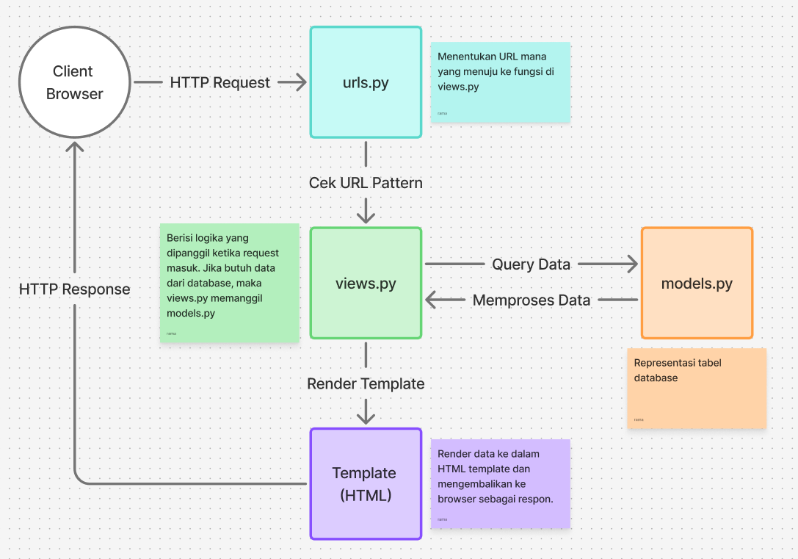

# Transfer Market

Tautan pws: https://walyulahdi-maulana-transfermarket.pbp.cs.ui.ac.id/

## Tugas 2

### Step-by-step Implementasi Checklist (Tugas 2)

1. Saya membuat proyek Django baru dengan menjalankan command

   ```bash
   django-admin startproject transfer_market
   ```

2. Membuat aplikasi main dengan command

   ```bash
   python manage.py startapp main
   ```

   kemudian menambahkan `'main'` ke dalam `INSTALLED_APP` pada `settings.py`.

3. Melakukan routing main dengan menambahkan

   ```python
   path('', include('main.urls'))
   ```

   pada `transfer_market/urls.py`.

4. Membuat model Product pada `main/models.py`

   ```python
   class Product(models.Model):
       name = models.CharField()
       price = models.IntegerField()
       description = models.TextField()
       thumbnail = models.URLField()
       category = models.CharField()
       is_featured = models.BooleanField()
       rating = models.FloatField()
   ```

5. Membuat fungsi pada `main/views.py`
   ```python
   def show_main(request):
       context = {
           'name' : 'Walyul\'ahdi Maulana Ramadhan',
           'npm' : '2406426012',
           'class' : 'PBP - F'
       }
       return render(request, "main.html", context)
   ```
6. Melakukan routing juga pada `main/urls.py`, dengan menambahkan
   ```python
   urlpatterns = [
       path('', show_main, name='show_main'),
   ]
   ```

### Bagan



### Peran settings.py dalam proyek Django

Mengatur konfigurasi proyek, seperti:

- INSTALLED_APP  
  Daftar aplikasi yang digunakan
- DATABASES  
  Koneksi ke database
- TEMPLATES  
  Konfigurasi template
- ALLOWED_HOSTS  
  Daftar host yang mempunyai akses

### Cara kerja migrasi database di Django

1. Saat menambah dan mengubah model menjalankan command

   ```bash
   python manage.py makemigrations
   ```

   File migrasi dibuat berdasarkan perubahan pada `models.py`.

2. Saat ingin menerapkan perubahan ke database menjalancan command

   ```bash
   python manage.py migrate
   ```

   Django mengeksekusi migrasi yang belum diterapkan di database.

3. Django menyimpan track migrasi yang sudah diterapkan di tabel `django_migrations`.

### Mengapa framework Django dijadikan permulaan pembelajaran pengembangan perangkat lunak?

Django dijadikan permulaan pembelajaran karena menyediakan fitur bawaan yang lengkap seperti ORM, autentikasi, dan admin panel tanpa membangun semua dari nol. Pola MVT pada Django juga cukup memudahkan dalam memahami konsep pengembangan perangkat lunak secara terstruktur. Selain itu, kami sudah familiar dengan bahasa pemrograman python sejak semester pertama.

### Feedback Tutorial 1

Menurut saya semua penjelasan step-by-step pada tutorial sudah jelas, sehingga saya dapat mengikuti dengan baik.

## Tugas 3

### Mengapa kita memerlukan data delivery dalam pengimplementasian sebuah platform?

Meong

### JSON vs XML

Meong

### Fungsi dari method is_valid() pada form Django dan mengapa dibutuhkan?

Meong

### Peran csrf_token pada form di Django, Apa yang terjadi jika tidak ada? dan Bagaimana hal tersebut dapat dimanfaatkan oleh penyerang?

Meong

### Step-by-step Implementasi Checklist (Tugas 3)

1. Meong
2. Meong

### Feedback Tutorial 2

Meong

### Mengakses Keempat URL di poin 2 (Postman)

1. XML


2. JSON


3. XML By ID


4. JSON
